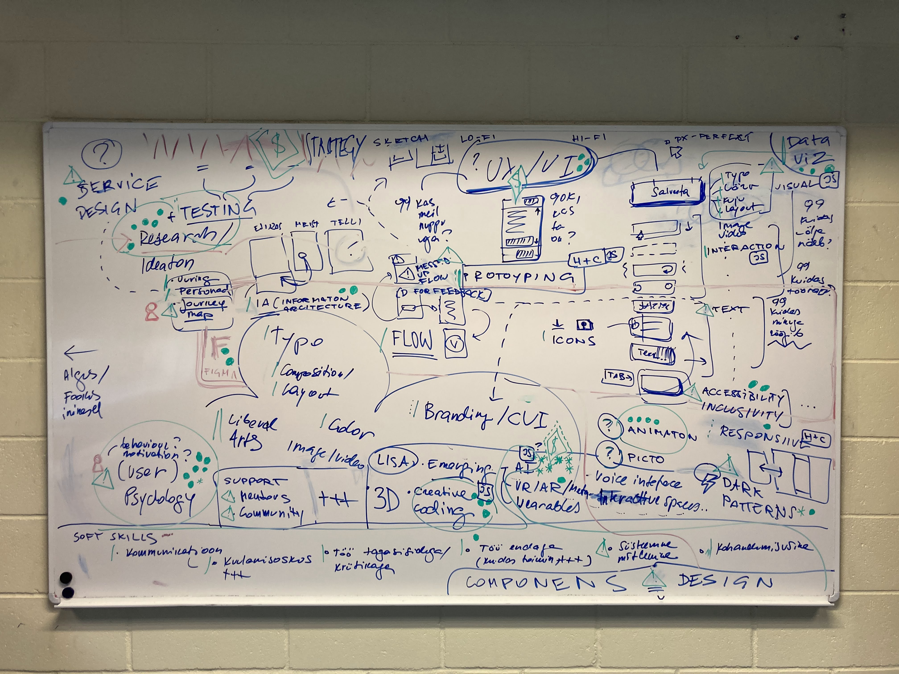
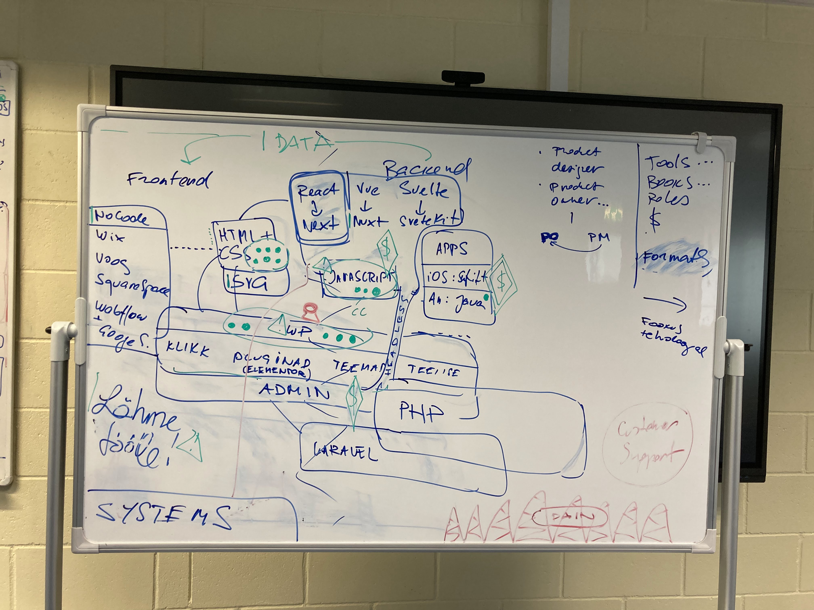

# KIG course outline

# Background / Basics

## Seeing design

📚 Classic. Don Norman. The Design of Everyday Things
http://library.lol/main/4BB8D08A9B309DF7D86E62EC4056CEEF

## Design psychology

📚 100 Things Every Designer Needs to Know About People (2ed) http://library.lol/main/057C15923B21C4391CD5E0546C58B13F

📚 Bonus: 100 MORE Things Every Designer Needs to Know About People
http://library.lol/main/8A87A2320385B9DFE46CA401E840C143

## Liberal arts

- Drawing
- Painting
- Art history

## Design building blocks

- Typography
- Color
- Composition / Layout / Spacing
- Vector graphics / Iconography
- Image
- Video
- Motion

## Branding

📚 "Designing Brand Identity: An Essential Guide for the Whole Branding Team" by Alina Wheeler http://library.lol/main/2E94F5A44E23BCC0BF22B1D8BF4BD9C6

# UX

## Overview

📺 IDEO: Shopping Cart Design Process
https://www.youtube.com/watch?v=izjhx17NuSE

📚 Design Thinking - The Handbook
http://library.lol/main/C0228C4313B1E8ADB9CDE191FDB23D6C

📚 The User Experience Team of One
http://library.lol/main/8D84BCDAC414A16161C175BCF664A0EB

➡️ https://digiriik.eesti.ee/

## UX research

📚 Just Enough Research http://library.lol/main/F6D2E2B0E4EE634CA8179639B544107E

- Reports (?)
- Personas
- Journey maps
- ...

## Information architecture

📚 Everyday Information Architecure http://library.lol/main/BF926AA9F7A8106BCEF73CA1BE049EF7

## User flows

## Lo-fi prototyping

## Patterns

### Dark patterns

📚 Evil by design: interaction design to lead us into temptation
 http://library.lol/main/95CC6CF39C8BCEFCFEA160FEBD9F572C

📚 Tragic Design: The Impact of Bad Product Design and How to Fix It
 http://library.lol/main/652AEA035033E1D60ACFBCB4CC103146

# UI

📚 Refactoring UI

Same design building blocks as in basics but in UI context

- Typography
- Color
- Composition / Layout / Spacing
- Shape
- Depth
- Icons

and

- Image
- Video
- Motion

and

- Interactions + Microinteractions

and

- Responsive design
- Text / Translations / Tone of voice
- Accessibility
  Accessibility for Everyone
  📚 http://library.lol/main/0396BD318253ED659989FF0A9B61342C
- Inclusivity

## Frontend

### No-code / lo-code

- Wix
- Voog
- Squarespace
- Webflow
- Google Sites

### HTML/CSS

#### SVG

Chris Coyer - Practical SVG
http://library.lol/main/AE8F09C91D5E4F01CE23AE5BC879925F

### Wordpress

- Admin
- Defaults
- Plugins (Elelentor)
- Themes
- DIY

Based on PHP. See also: Laravel (out of scope)

### Javascript

- Creative coding
- Frameworks
  -- React + Next
  -- Vue + Nuxt
  -- Svelte + Sveltekit

# Design systems

📚 http://library.lol/main/99AF800C71FCE99C16BDBC682EE76B08

## Other

### Exercises

- Observation
- Reverse engineer / desconstruct
- Copy work
- Reflection

### Work with data

- Data visualization
- Data-driven UIs

### 3D

Spline

### Emerging tech / other devices

- AI
- Wearables
- Large screens / kiosks
- Spatial installations / exibithions
- VR / AR / Metaverse
- Web3 / NFT
- Voice UIs

## Prep for work / Presentations

- Presentations https://abookapart.com/products/demystifying-public-speaking
- Portfolio
- Job market

## Soft skills

### Communication

- Listening
  - Why/how laddering https://field.so/en/blog/why-how-laddering-how-the-product-field-tells-you-when-to-use-it
- Communication hygene
  - Not interruptions
  - Being on control of your own biases
  - Practive active listening
  - Control your body language

### Receiving critique

...

### Self-awareness

Reflecting, questions, understaing how your mind works and biases

Tools:

- Journaling
- Introspection
- Meditaion
- Therapy

### Critical thinking and problem-solving

- Unpack and deeply understand problem.
- Explore the problem solution space
- Think in systems
- Make connections, grasp large volume of data and connections.

📚 https://rosenfeldmedia.com/books/systems-thinking-for-designers/ (Feb 2023)

### Adaptability

Adjust to changes

## Support

### Mentors (formal / accidental)

- Give suggested learning path
- Challenge you to think critically
- Help you to see, own and learn from mistakes
- Guide you into understanding the role of UX designer
- Show you what goes on the industry

### Other designers

- Realtime (events, coffee)
- Async (chats, podcasts)

## Out of scope

### App UIs

- iOS: Swift + Swift UI
- Android: Java + Kotlin

### Backends

### Data science and AI

### Devops

# Bla

https://rosenfeldmedia.com/books/
